## User register
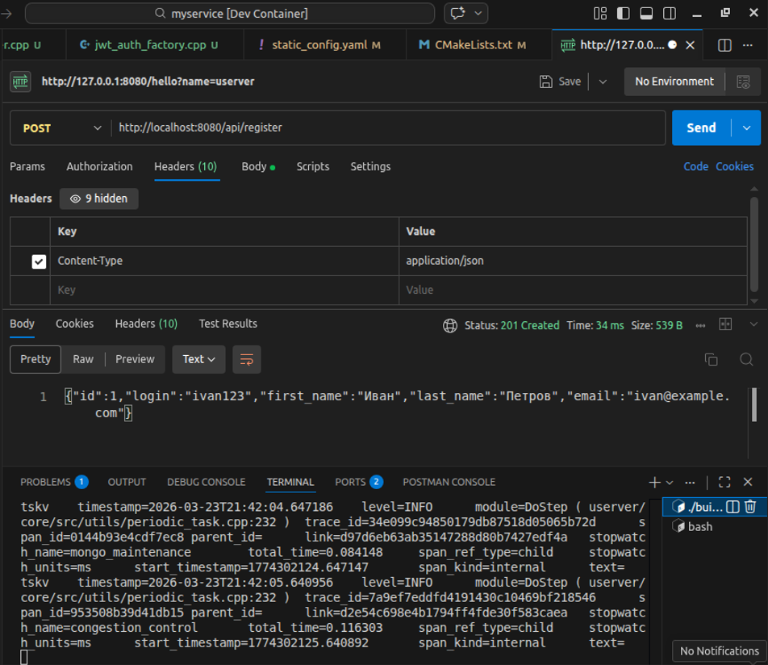

## User login
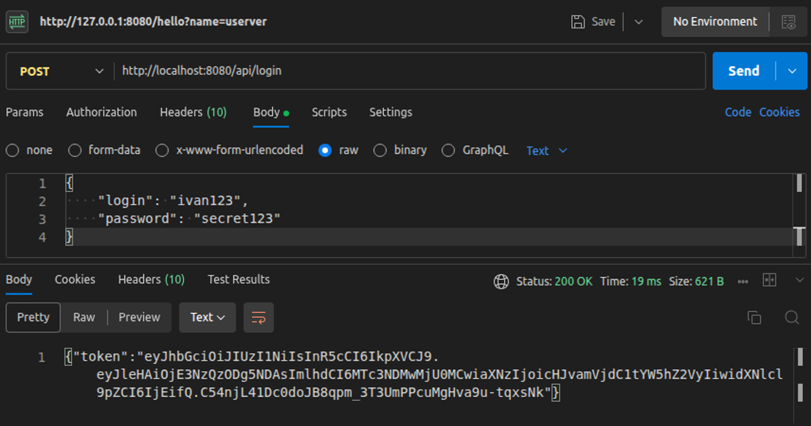

## jwt.io jwt check
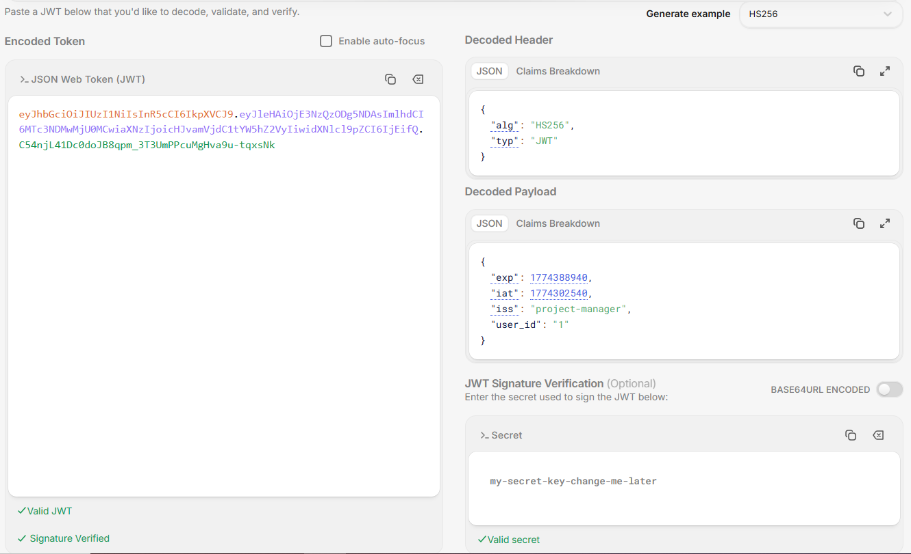

## User login wrong password
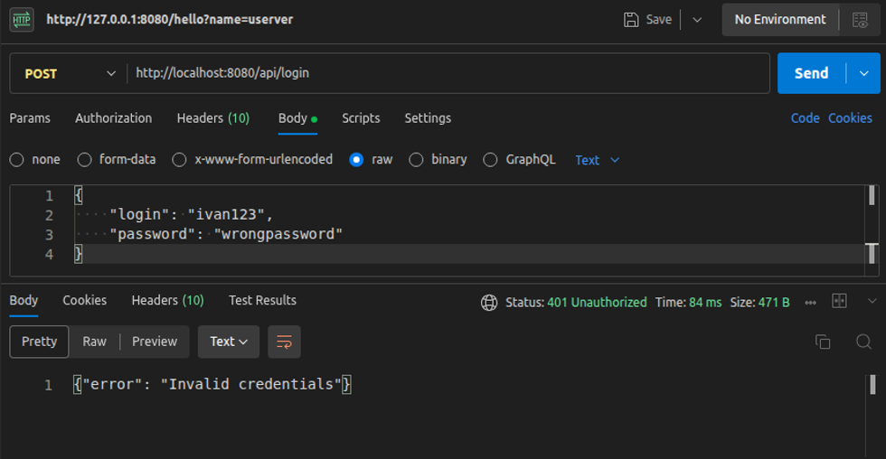

## User login wrong login
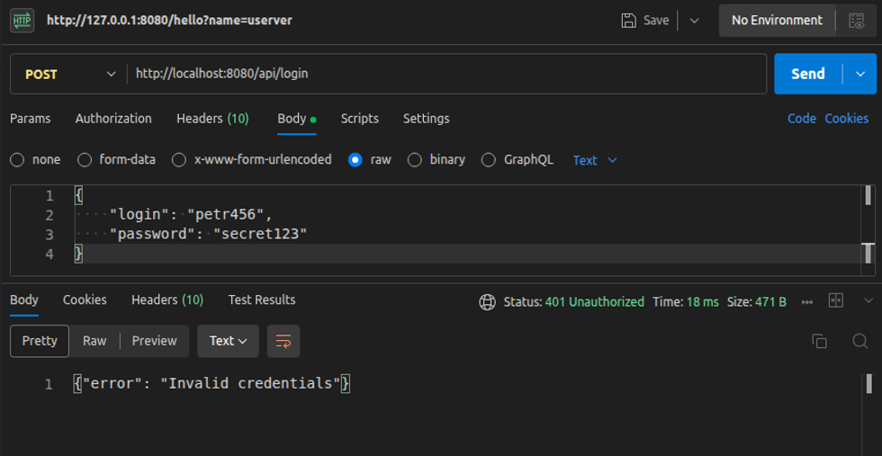

## User login missing password 
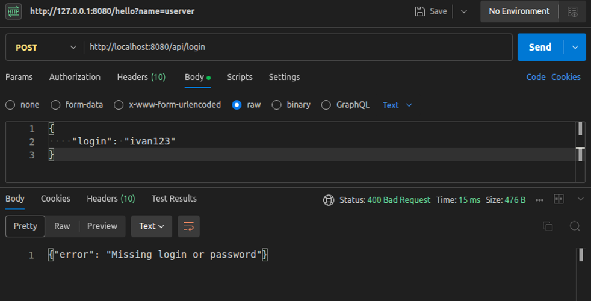

## User register user already exists
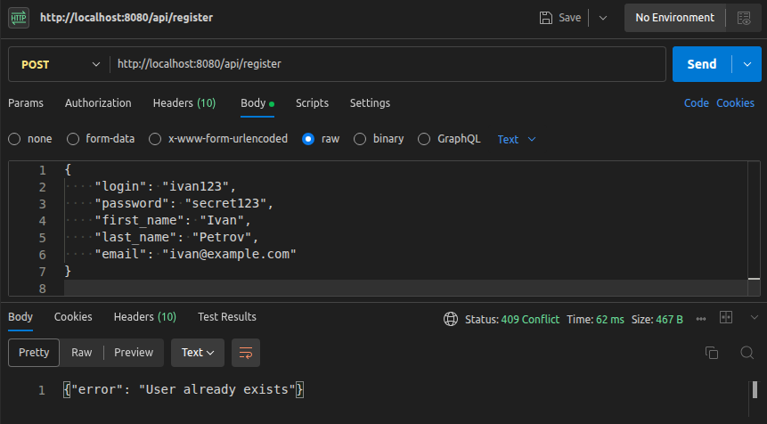

## Get user by login
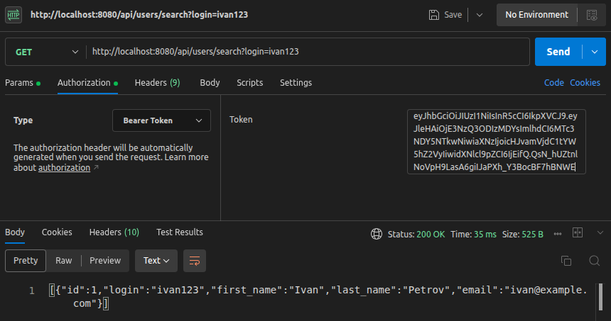

## Get user by first name and last name masks
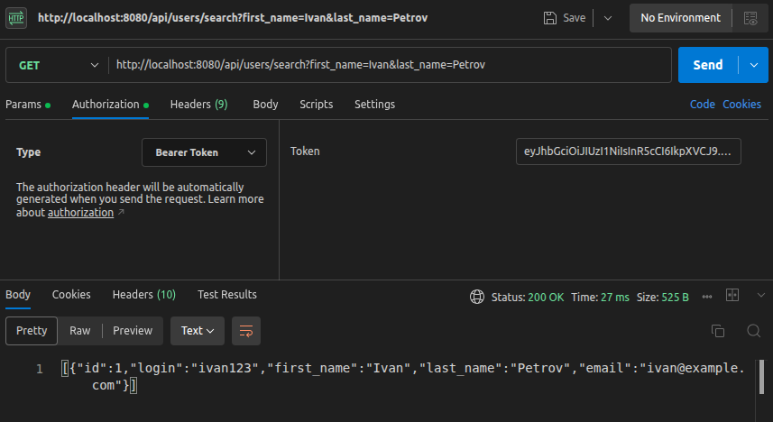

## Create (post) a project
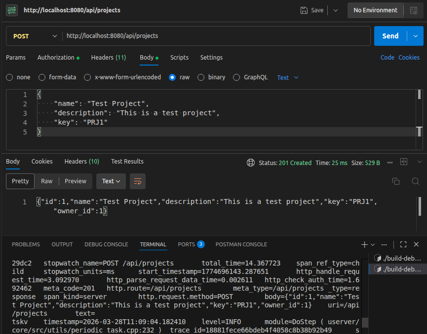

## Get projects list
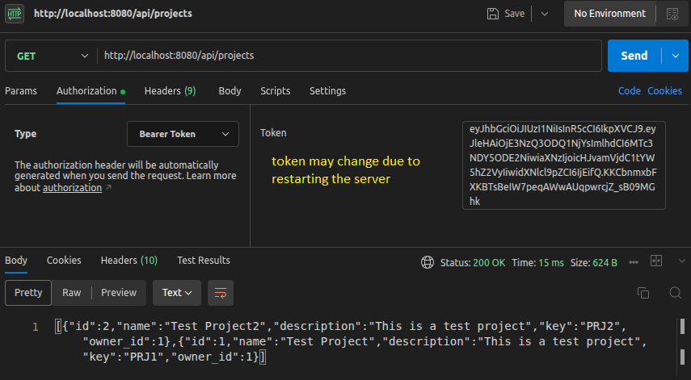

## Create (post) a task
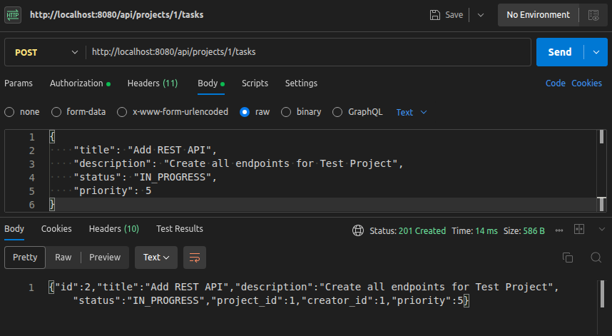

## Create (post) a task in non-existent project
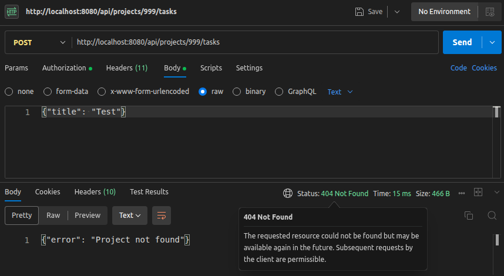